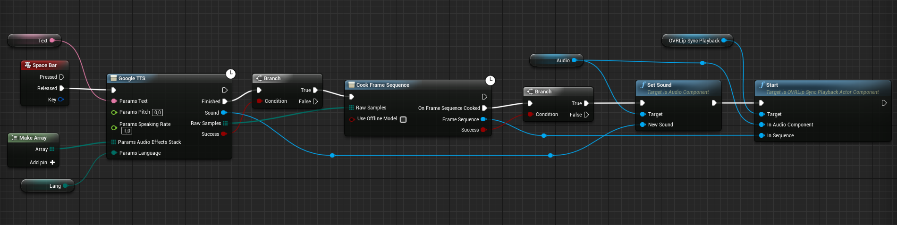

# UE4 OVR lipsync cook frame sequence

Async node to build ovr frame sequence during runtime.
Written to be used with [Google Speech Kit](https://github.com/IlgarLunin/UE4GoogleSpeechKit-docs) plugin.

# Raw samples content

Node expects to get uncompressed wave pcm data with 44 bytes header.

# Installation

1) Copy **CookFrameSequenceAsync.h** to `PROJECT_ROOT/Plugins/OVRLipSync/Source/OVRLipSync/Public`
2) Copy **CookFrameSequenceAsync.cpp** to `PROJECT_ROOT/Plugins/OVRLipSync/Source/OVRLipSync/Private`
3) Compile and run
